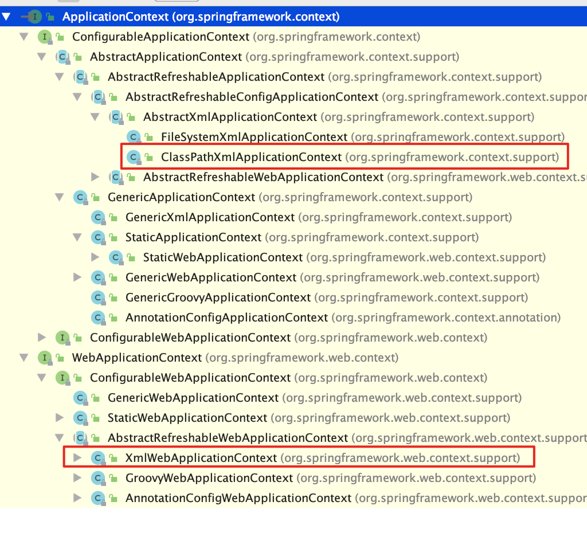
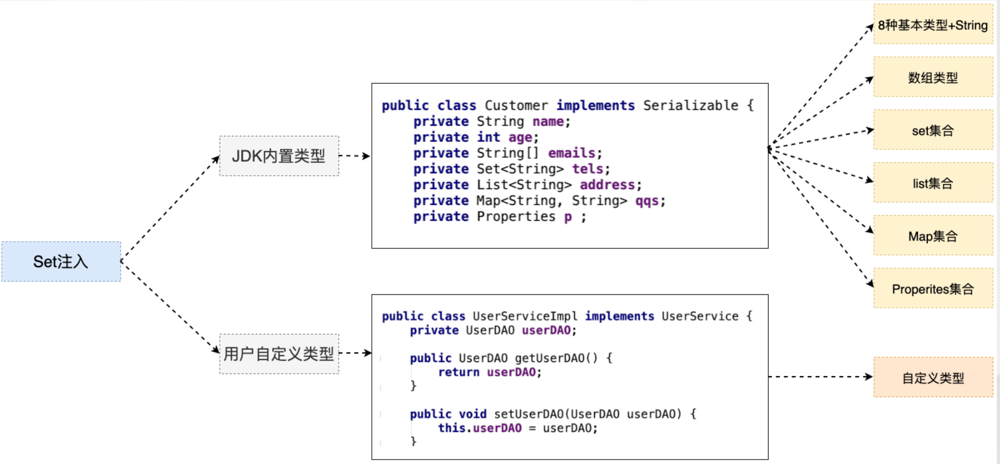

### 百知教育 — Spring系列课程 — 工厂

---

#### 第一章 引言

##### 1. EJB存在的问题

##### 2. 什么是Spring

~~~markdown
Spring是一个轻量级的JavaEE解决方案，整合众多优秀的设计模式
~~~

- 轻量级

  ~~~markdown
  1. 对于运行环境是没有额外要求的
     开源 tomcat resion jetty 
     收费 weblogic  websphere 
  2. 代码移植性高
     不需要实现额外接口
  ~~~

- JavaEE的解决方案

- 整合设计模式

~~~markdown
1. 工厂
2. 代理
3. 模板
4. 策略
~~~

##### 3. 设计模式

~~~markdown
1. 广义概念
面向对象设计中，解决特定问题的经典代码
2. 狭义概念
GOF4人帮定义的23种设计模式：工厂、适配器、装饰器、门面、代理、模板...
~~~

##### 4. 工厂设计模式

###### 4.1 什么是工厂设计模式

~~~markdown
1. 概念：通过工厂类，创建对象
        User user = new User();
        UserDAO userDAO = new UserDAOImpl();
2. 好处：解耦合
   耦合：指定是代码间的强关联关系，一方的改变会影响到另一方
   问题：不利于代码维护
   简单：把接口的实现类，硬编码在程序中
        UserService userService = new UserServiceImpl();
~~~

###### 4.2 简单工厂的设计

~~~java
package com.baizhiedu.basic;

import java.io.IOException;
import java.io.InputStream;
import java.util.Properties;

public class BeanFactory {
    private static Properties env = new Properties();

    static{
        try {
            //第一步 获得IO输入流
            InputStream inputStream = BeanFactory.class.getResourceAsStream("/applicationContext.properties");
            //第二步 文件内容 封装 Properties集合中 key = userService value = com.baizhixx.UserServiceImpl
            env.load(inputStream);

            inputStream.close();
        } catch (IOException e) {
            e.printStackTrace();
        }

    }

    /*
        对象的创建方式：
           1. 直接调用构造方法 创建对象  UserService userService = new UserServiceImpl();
           2. 通过反射的形式 创建对象 解耦合
               Class clazz = Class.forName("com.baizhiedu.basic.UserServiceImpl");
               UserService userService = (UserService)clazz.newInstance();
     */
    public static UserService getUserService() {

        UserService userService = null;
        try {
                                         //com.baizhiedu.basic.UserServiceImpl
            Class clazz = Class.forName(env.getProperty("userService"));
            userService = (UserService) clazz.newInstance();
        } catch (ClassNotFoundException e) {
            e.printStackTrace();
        } catch (InstantiationException e) {
            e.printStackTrace();
        } catch (IllegalAccessException e) {
            e.printStackTrace();
        }

        return userService;

    }

    public static UserDAO getUserDAO(){

        UserDAO userDAO = null;
        try {
            Class clazz = Class.forName(env.getProperty("userDAO"));
            userDAO = (UserDAO) clazz.newInstance();
        } catch (ClassNotFoundException e) {
            e.printStackTrace();
        } catch (InstantiationException e) {
            e.printStackTrace();
        } catch (IllegalAccessException e) {
            e.printStackTrace();
        }

        return userDAO;

    }
}
~~~

###### 4.3 通用工厂的设计

- 问题

  ~~~markdown
  简单工厂会存在大量的代码冗余
  ~~~

  

- 通用工厂的代码

  ~~~java
  创建一切想要的对象
  public class BeanFactory{
    
      public static Object getBean(String key){
           Object ret = null;
           try {
               Class clazz = Class.forName(env.getProperty(key));
               ret = clazz.newInstance();
           } catch (Exception e) {
              e.printStackTrace();
           }
           return ret;
       }
  
  }
  ~~~

###### 4.4 通用工厂的使用方式

~~~markdown
1. 定义类型 (类)
2. 通过配置文件的配置告知工厂(applicationContext.properties)
   key = value
3. 通过工厂获得类的对象
   Object ret = BeanFactory.getBean("key")
~~~

##### 5.总结

~~~markdown
Spring本质：工厂 ApplicationContext (applicationContext.xml)
~~~

#### 第二章、第一个Spring程序

##### 1. 软件版本

~~~markdown
1. JDK1.8+
2. Maven3.5+
3. IDEA2018+
4. SpringFramework 5.1.4 
   官方网站 www.spring.io
~~~

##### 2. 环境搭建

- Spring的jar包

  ~~~markdown
  #设置pom 依赖
  <!-- https://mvnrepository.com/artifact/org.springframework/spring-context -->
  <dependency>
    <groupId>org.springframework</groupId>
    <artifactId>spring-context</artifactId>
    <version>5.1.4.RELEASE</version>
  </dependency>
  ~~~

- Spring的配置文件

  ~~~markdown
  1. 配置文件的放置位置：任意位置 没有硬性要求
  2. 配置文件的命名   ：没有硬性要求  建议：applicationContext.xml
  
  思考：日后应用Spring框架时，需要进行配置文件路径的设置。
  ~~~

  

##### 3. Spring的核心API

- ApplicationContext

  ~~~markdown
  作用：Spring提供的ApplicationContext这个工厂，用于对象的创建
  好处：解耦合
  ~~~

  - ApplicationContext接口类型

    ~~~markdown
    接口：屏蔽实现的差异
    非web环境 ： ClassPathXmlApplicationContext (main junit)
    web环境  ：  XmlWebApplicationContext
    ~~~

    

  -  重量级资源

    ~~~markdown
    ApplicationContext工厂的对象占用大量内存。
    不会频繁的创建对象 ： 一个应用只会创建一个工厂对象。
    ApplicationContext工厂：一定是线程安全的(多线程并发访问)
    ~~~

    

##### 4. 程序开发

~~~markdown
1. 创建类型
2. 配置文件的配置 applicationContext.xml
   <bean id="person" class="com.baizhiedu.basic.Person"/>
3. 通过工厂类，获得对象
   ApplicationContext
          |- ClassPathXmlApplicationContext 
   ApplicationContext ctx = new ClassPathXmlApplicationContext("/applicationContext.xml");
   Person person = (Person)ctx.getBean("person");
~~~

##### 5. 细节分析

- 名词解释

  ~~~markdown
  Spring工厂创建的对象，叫做bean或者组件(componet)
  ~~~

- Spring工厂的相关的方法

  ~~~java
  //通过这种方式获得对象，就不需要强制类型转换
  Person person = ctx.getBean("person", Person.class);
  System.out.println("person = " + person);
          
  
  //当前Spring的配置文件中 只能有一个<bean class是Person类型
  Person person = ctx.getBean(Person.class);
  System.out.println("person = " + person);
          
  
  //获取的是 Spring工厂配置文件中所有bean标签的id值  person person1
  String[] beanDefinitionNames = ctx.getBeanDefinitionNames();
  for (String beanDefinitionName : beanDefinitionNames) {
    System.out.println("beanDefinitionName = " + beanDefinitionName);
  }
          
  
  //根据类型获得Spring配置文件中对应的id值
  String[] beanNamesForType = ctx.getBeanNamesForType(Person.class);
  for (String id : beanNamesForType) {
    System.out.println("id = " + id);
  }
          
  
  //用于判断是否存在指定id值得bean
  if (ctx.containsBeanDefinition("a")) {
    System.out.println("true = " + true);
  }else{
    System.out.println("false = " + false);
  }
        
  
  //用于判断是否存在指定id值得bean
  if (ctx.containsBean("person")) {
    System.out.println("true = " + true);
  }else{
    System.out.println("false = " + false);
  }
  ~~~

- 配置文件中需要注意的细节

  ~~~markdown
  1. 只配置class属性
  <bean  class="com.baizhiedu.basic.Person"/>
  a) 上述这种配置 有没有id值 com.baizhiedu.basic.Person#0
  b) 应用场景： 如果这个bean只需要使用一次，那么就可以省略id值
              如果这个bean会使用多次，或者被其他bean引用则需要设置id值
  
  
  2. name属性
  作用：用于在Spring的配置文件中，为bean对象定义别名(小名)
  相同：
     1. ctx.getBean("id|name")-->object
     2. <bean id="" class=""
        等效
        <bean name="" class=""
  区别：
     1. 别名可以定义多个,但是id属性只能有一个值
     2. XML的id属性的值，命名要求：必须以字母开头，字母 数字 下划线 连字符 不能以特殊字符开头 /person
           name属性的值，命名没有要求 /person
        name属性会应用在特殊命名的场景下：/person (spring+struts1)
        
        XML发展到了今天：ID属性的限制，不存在 /person
     3. 代码
           //用于判断是否存在指定id值得bean,不能判断name值
          if (ctx.containsBeanDefinition("person")) {
              System.out.println("true = " + true);
          }else{
              System.out.println("false = " + false);
          }
  
  
          //用于判断是否存在指定id值得bean,也可以判断name值
          if (ctx.containsBean("p")) {
              System.out.println("true = " + true);
          }else{
              System.out.println("false = " + false);
          }
  ~~~

##### 6. Spring工厂的底层实现原理(简易版)

**Spring工厂是可以调用对象私有的构造方法创建对象**

##### 7. 思考

~~~markdown
问题：未来在开发过程中，是不是所有的对象，都会交给Spring工厂来创建呢？
回答：理论上 是的，但是有特例 ：实体对象(entity)是不会交给Spring创建，它是由持久层框架进行创建。
~~~

#### 第三章、Spring5.x与日志框架的整合

~~~1.markdown
Spring与日志框架进行整合，日志框架就可以在控制台中，输出Spring框架运行过程中的一些重要的信息。
好处：便于了解Spring框架的运行过程，利于程序的调试
~~~

- Spring如何整合日志框架

  ~~~markdown
  默认
    Spring1.2.3早期都是于commons-logging.jar
    Spring5.x默认整合的日志框架 logback log4j2
  
  Spring5.x整合log4j 
    1. 引入log4j jar包
    2. 引入log4.properties配置文件
  ~~~

  - pom

    ~~~xml
    <dependency>
      <groupId>org.slf4j</groupId>
      <artifactId>slf4j-log4j12</artifactId>
      <version>1.7.25</version>
    </dependency>
    
    <dependency>
      <groupId>log4j</groupId>
      <artifactId>log4j</artifactId>
      <version>1.2.17</version>
    </dependency>
    ~~~

  - log4j.properties

    ~~~markdown
    # resources文件夹根目录下
    ### 配置根
    log4j.rootLogger = debug,console
    
    ### 日志输出到控制台显示
    log4j.appender.console=org.apache.log4j.ConsoleAppender
    log4j.appender.console.Target=System.out
    log4j.appender.console.layout=org.apache.log4j.PatternLayout
    log4j.appender.console.layout.ConversionPattern=%d{yyyy-MM-dd HH:mm:ss} %-5p %c{1}:%L - %m%n
    ~~~

    

#### 第四章、注入(Injection)

##### 1. 什么是注入

~~~markdown
通过Spring工厂及配置文件，为所创建对象的成员变量赋值
~~~

###### 1.1 为什么需要注入

**通过编码的方式，为成员变量进行赋值，存在耦合**

###### 1.2 如何进行注入[开发步骤]

- 类的成员变量提供set get方法

- 配置spring的配置文件

  ~~~xml
   <bean id="person" class="com.baizhiedu.basic.Person">
     <property name="id">
       <value>10</value>
     </property>
     <property name="name">
       <value>xiaojr</value>
     </property>
  </bean>
  ~~~

###### 1.3 注入好处

~~~markdown
解耦合
~~~

##### 2. Spring注入的原理分析(简易版)

**Spring通过底层调用对象属性对应的set方法，完成成员变量的赋值，这种方式我们也称之为set注入**

#### 第五章、Set注入详解

~~~markdown
针对于不同类型的成员变量，在<property>标签，需要嵌套其他标签

<property>
    xxxxx
</property>
~~~

##### 1. JDK内置类型

###### 1.1 String+8种基本类型

~~~markdown
<value>suns</value>
~~~

###### 1.2 数组

~~~markdown
<list>
  <value>suns@zparkhr.com.cn</value>
  <value>liucy@zparkhr.com.cn</value>
  <value>chenyn@zparkhr.com.cn</value>
</list>
~~~

###### 1.3 Set集合

~~~xml
<set>
   <value>11111</value>
   <value>112222</value>
</set>

<set>
   <ref bean
   <set 
</set>
~~~

###### 1.4 List集合

~~~xml
<list>
   <value>11111</value>
   <value>2222</value>
</list>

<list>
   <ref bean
   <set 
</list>
~~~

###### 1.5 Map集合

~~~xml
注意： map -- entry  -- key有特定的标签  <key></key>
                       值根据对应类型选择对应类型的标签
<map>
  <entry>
    <key><value>suns</value></key>
    <value>3434334343</value>
  </entry>
  <entry>
    <key><value>chenyn</value></key>
    <ref bean
  </entry>
</map>
~~~

###### 1.6 Properites

~~~markdown
Properties类型 特殊的Map key=String value=String 
~~~

~~~xml
<props>
  <prop key="key1">value1</prop>
  <prop key="key2">value2</prop>
</props>
~~~

###### 1.7 复杂的JDK类型 (Date)

~~~markdown
需要程序员自定义类型转换器，处理。
~~~

##### 2. 用户自定义类型

###### 2.1 第一种方式

- 为成员变量提供set get方法

- 配置文件中进行注入(赋值)

  ~~~xml
  <bean id="userService" class="xxxx.UserServiceImpl">
     <property name="userDAO">
         <bean class="xxx.UserDAOImpl"/>
    </property>
  </bean>
  ~~~

###### 2.2 第二种方式

- 第一种赋值方式存在的问题

  ~~~markdown
  1. 配置文件代码冗余
  2. 被注入的对象(UserDAO),多次创建，浪费（JVM)内存资源
  ~~~

- 为成员变量提供set get方法

- 配置文件中进行配置

  ~~~xml
  <bean id="userDAO" class="xxx.UserDAOImpl"/>
  
  <bean id="userService" class="xxx.UserServiceImpl">
     <property name="userDAO">
          <ref bean="userDAO"/>
    </property>
  </bean>
  
  #Spring4.x 废除了 <ref local=""/> 基本等效 <ref bean=""/>
  ~~~

  ##### 3. Set注入的简化写法

  ###### 3.1 基于属性简化

  ~~~xml
  JDK类型注入 
  <property name="name">
     <value>suns</value>
  </property>
  
  <property name="name" value="suns"/>
  注意：value属性 只能简化 8种基本类型+String 注入标签
  
  用户自定义类型
  <property name="userDAO">
     <ref bean="userDAO"/>
  </property>
  
  <property name="userDAO" ref="userDAO"/>
  ~~~

  ###### 3.2 基于p命名空间简化

  ~~~xml
  JDK类型注入 
  <bean id="person" class="xxxx.Person">
    <property name="name">
       <value>suns</value>
    </property>
  </bean>
  
  <bean id="person" class="xxx.Person" p:name="suns"/>
  注意：value属性 只能简化 8种基本类型+String 注入标签
  
  用户自定义类型
  <bean id="userService" class="xx.UserServiceImpl">
    <property name="userDAO"> 
      <ref bean="userDAO"/>
     </property>
  </bean>
  
  <bean id="userService" class="xxx.UserServiceImpl" p:userDAO-ref="userDAO"/>
  ~~~

#### 第六章、构造注入

~~~markdown
注入：通过Spring的配置文件，为成员变量赋值
Set注入：Spring调用Set方法 通过配置文件 为成员变量赋值
构造注入：Spring调用构造方法 通过配置文件 为成员变量赋值
~~~

##### 1. 开发步骤

- 提供有参构造方法

  ~~~java
  public class Customer implements Serializable {
      private String name;
      private int age;
  
      public Customer(String name, int age) {
          this.name = name;
          this.age = age;
      }
  }
  ~~~

- Spring的配置文件

  ~~~xml
  <bean id="customer" class="com.baizhiedu.basic.constructer.Customer">
    <constructor-arg>
      <value>suns</value>
    </constructor-arg>
    <constructor-arg>
      <value>102</value>
    </constructor-arg>
  </bean>
  ~~~

##### 2. 构造方法重载

###### 2.1 参数个数不同时

~~~markdown
通过控制<constructor-arg>标签的数量进行区分 
~~~

###### 2.1 构造参数个数相同时

~~~markdown
通过在标签引入 type属性 进行类型的区分 <constructor-arg type="">
~~~

##### 3. 注入的总结

~~~markdown
未来的实战中，应用set注入还是构造注入？
答案：set注入更多 
       1. 构造注入麻烦 (重载)
       2. Spring框架底层 大量应用了 set注入
~~~

#### 第七章、反转控制 与 依赖注入

##### 1. 反转(转移)控制(IOC Inverse of Control)

~~~markdown
控制：对于成员变量赋值的控制权
反转控制：把对于成员变量赋值的控制权，从代码中反转(转移)到Spring工厂和配置文件中完成
   好处：解耦合
底层实现：工厂设计模式
~~~

##### 2. 依赖注入 (Dependency Injection  DI)

~~~markdown
注入：通过Spring的工厂及配置文件，为对象（bean，组件）的成员变量赋值

依赖注入：当一个类需要另一个类时，就意味着依赖，一旦出现依赖，就可以把另一个类作为本类的成员变量，最终通过Spring配置文件进行注入(赋值)。
   好处：解耦合
~~~

#### 第八章、Spring工厂创建复杂对象

##### 1. 什么是复杂对象

~~~markdown
复杂对象：指的就是不能直接通过new构造方法创建的对象
  Connection
  SqlSessionFactory
~~~

##### 2. Spring工厂创建复杂对象的3种方式

###### 2.1 FactoryBean接口

- 开发步骤
  - 实现FactoryBean接口
    
    
  - Spring配置文件的配置
    
    ~~~xml
    # 如果Class中指定的类型 是FactoryBean接口的实现类，那么通过id值获得的是这个类所创建的复杂对象  Connection
    <bean id="conn" class="com.baizhiedu.factorybean.ConnectionFactoryBean"/>
    ~~~
  
- 细节

  - 如果就想获得FactoryBean类型的对象   ctx.getBean("&conn")
    获得就是ConnectionFactoryBean对象

  - isSingleton方法
    返回  true 只会创建一个复杂对象

    返回 false 每一次都会创建新的对象
    问题：根据这个对象的特点 ，决定是返回true (SqlSessionFactory) 还是 false  (Connection)

  - mysql高版本连接创建时，需要制定SSL证书，解决问题的方式

    ~~~markdown
    url = "jdbc:mysql://localhost:3306/suns?useSSL=false"
    ~~~

  - 依赖注入的体会(DI)

    ~~~markdown
    把ConnectionFactoryBean中依赖的4个字符串信息 ，进行配置文件的注入 
    好处：解耦合
    <bean id="conn" class="com.baizhiedu.factorybean.ConnectionFactoryBean">
      <property name="driverClassName" value="com.mysql.jdbc.Driver"/>
      <property name="url" value="jdbc:mysql://localhost:3306/suns?useSSL=false"/>
      <property name="username" value="root"/>
      <property name="password" value="123456"/>
    </bean>
    ~~~

- FactoryBean的实现原理[简易版]

  ~~~xml
  接口回调
  1. 为什么Spring规定FactoryBean接口 实现 并且 getObject()?
  2. ctx.getBean("conn") 获得是复杂对象 Connection 而没有 获得 ConnectionFactoryBean(&)
  
  Spring内部运行流程
  1. 通过conn获得 ConnectionFactoryBean类的对象 ，进而通过instanceof 判断出是FactoryBean接口的实现类
  2. Spring按照规定 getObject() ---> Connection
  3. 返回Connection 
  ~~~

  

  

  

  

- FactoryBean总结

  ~~~markdown
  Spring中用于创建复杂对象的一种方式，也是Spring原生提供的，后续讲解Spring整合其他框架，大量应用FactoryBean
  ~~~

###### 2.2 实例工厂

~~~markdown
1. 避免Spring框架的侵入 
2. 整合遗留系统 
~~~

- 开发步骤

~~~xml
 <bean id="connFactory" class="com.baizhiedu.factorybean.ConnectionFactory"></bean>

 <bean id="conn"  factory-bean="connFactory" factory-method="getConnection"/>
~~~

###### 2.3 静态工厂

- 开发步骤

  ~~~xml
  <bean id="conn" class="com.baizhiedu.factorybean.StaticConnectionFactory" factory-method="getConnection"/>
  ~~~

##### 3. Spring工厂创建对象的总结 

#### 第九章、控制Spring工厂创建对象的次数

##### 1. 如何控制简单对象的创建次数 

~~~xml
<bean id="account" scope="singleton|prototype" class="xxxx.Account"/>
sigleton:只会创建一次简单对象 默认值
prototype:每一次都会创建新的对象
~~~

##### 2. 如何控制复杂对象的创建次数

~~~markdown
FactoryBean{
   isSingleton(){
      return true  只会创建一次
      return false 每一次都会创建新的
   }

}
如没有isSingleton方法 还是通过scope属性 进行对象创建次数的控制
~~~

##### 3. 为什么要控制对象的创建次数？

~~~markdown
好处：节省不别要的内存浪费 
~~~

- 什么样的对象只创建一次？

  ~~~markdown
  1. SqlSessionFactory
  2. DAO
  3. Service
  ~~~

- 什么样的对象 每一次都要创建新的？

  ~~~markdown
  1. Connection
  2. SqlSession | Session
  3. Struts2 Action
  ~~~

  

​    

