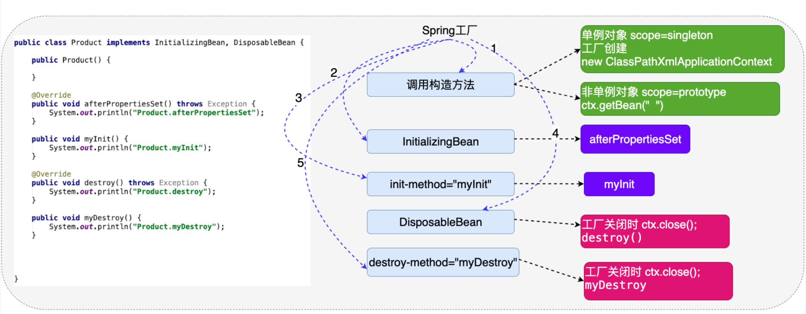
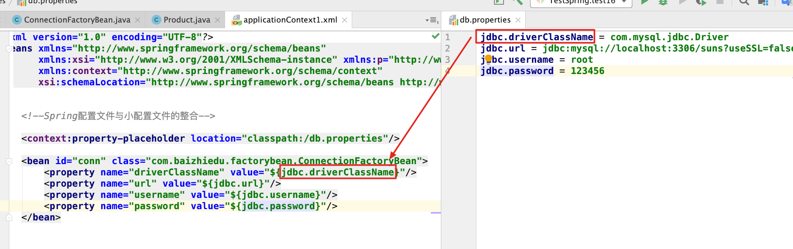
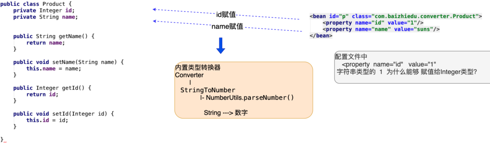
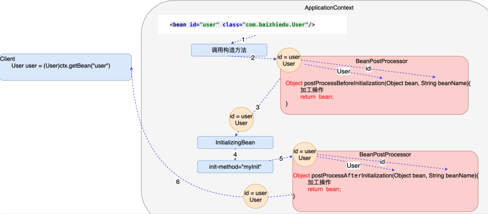

### 百知教育 — Spring系列课程 — 工厂高级特性

----

#### 第十章、对象的生命周期

##### 1. 什么是对象的生命周期

~~~markdown
指的是一个对象创建、存活、消亡的一个完整过程
~~~

##### 2. 为什么要学习对象的生命周期

~~~markdown
由Spring负责对象的创建、存活、销毁，了解生命周期，有利于我们使用好Spring为我们创建的对象
~~~

##### 3. 生命周期的3个阶段

- 创建阶段

  ~~~markdown
  Spring工厂何时创建对象
  ~~~

  - scope="singleton"

    ~~~markdown
    Spring工厂创建的同时，对象的创建
    
    注意：设置scope=singleton 这种情况下 也需要在获取对象的同时，创建对象 
    <bean lazy-init="true"/>
    ~~~

  - scope="prototype"

    ~~~markdown
    Spring工厂会在获取对象的同时，创建对象
    ctx.getBean("")
    ~~~

- 初始化阶段

  ~~~markdown
  Spring工厂在创建完对象后，调用对象的初始化方法，完成对应的初始化操作
  
  1. 初始化方法提供：程序员根据需求，提供初始化方法，最终完成初始化操作
  2. 初始化方法调用：Spring工厂进行调用
  ~~~

  - InitializingBean接口

    ~~~java
    //程序员根据需求，实现的方法，完成初始化操作
    public void afterProperitesSet(){
      
    }
    ~~~

  - 对象中提供一个普通的方法

    ~~~java
    public void myInit(){
      
    }
    
    <bean id="product" class="xxx.Product" init-method="myInit"/>
    ~~~

  - 细节分析

    1. 如果一个对象即实现InitializingBean 同时又提供的 普通的初始化方法  顺序

       ~~~markdown
       1. InitializingBean 
       2. 普通初始化方法
       ~~~

    2. 注入一定发生在初始化操作的前面

    3. 什么叫做初始化操作 

       ~~~markdown
       资源的初始化：数据库 IO 网络 .....
       ~~~

- 销毁阶段

  ~~~markdown
  Spring销毁对象前，会调用对象的销毁方法，完成销毁操作
  
  1. Spring什么时候销毁所创建的对象？
     ctx.close();
  2. 销毁方法：程序员根据自己的需求，定义销毁方法，完成销毁操作
        调用：Spring工厂完成调用
  ~~~

  - DisposableBean

    ~~~java
    public void destroy()throws Exception{
      
    }
    ~~~

  - 定义一个普通的销毁方法

    ~~~java
    public void myDestroy()throws Exception{
    
    }
    <bean id="" class="" init-method="" destroy-method="myDestroy"/>
    ~~~

  - 细节分析

    1. 销毁方法的操作只适用于 scope="singleton"

    2. 什么叫做销毁操作

       ~~~markdown
       主要指的就是 资源的释放操作  io.close() connection.close();
       ~~~

       

#### 第十一章、配置文件参数化

~~~markdown
把Spring配置文件中需要经常修改的字符串信息，转移到一个更小的配置文件中

1. Spring的配置文件中存在需要经常修改的字符串？
   存在 以数据库连接相关的参数 代表
2. 经常变化字符串，在Spring的配置文件中，直接修改
   不利于项目维护(修改)
3. 转移到一个小的配置文件(.properties)
   利于维护(修改)
   
配置文件参数化：利于Spring配置文件的维护(修改)
~~~

##### 1. 配置文件参数的开发步骤

- 提供一个小的配置文件(.properities)

  ~~~properties
  名字：随便
  放置位置：随便
  
  jdbc.driverClassName = com.mysql.jdbc.Driver
  jdbc.url = jdbc:mysql://localhost:3306/suns?useSSL=false
  jdbc.username = root
  jdbc.password = 123456
  ~~~

- Spring的配置文件与小配置文件进行整合

  ~~~xml
  applicationContext.xml
  <context:property-placeholder location="classpath:/db.properties"/>
  ~~~

- 在Spring配置文件中通过${key}获取小配置文件中对应的值
  

#### 第十二章、自定义类型转换器

##### 1. 类型转换器

~~~markdown
作用：Spring通过类型转换器把配置文件中字符串类型的数据，转换成了对象中成员变量对应类型的数据，进而完成了注入
~~~

##### 2. 自定义类型转换器

~~~markdown
原因：当Spring内部没有提供特定类型转换器时，而程序员在应用的过程中还需要使用，那么就需要程序员自己定义类型转换器
~~~

- 类 implements Converter接口

  ~~~java
  public class MyDateConverter implements Converter<String, Date> {
     /*
         convert方法作用：String --->  Date
                        SimpleDateFormat sdf = new SimpleDateFormat();
                        sdf.parset(String) ---> Date
         param:source 代表的是配置文件中 日期字符串 <value>2020-10-11</value>
  
         return : 当把转换好的Date作为convert方法的返回值后，Spring自动的为birthday属性进行注入（赋值）
  
       */
  
    @Override
    public Date convert(String source) {
  
      Date date = null;
      try {
        SimpleDateFormat sdf = new SimpleDateFormat("yyyy-MM-dd");
        date = sdf.parse(source);
      } catch (ParseException e) {
        e.printStackTrace();
      }
      return date;
    }
  }
  ~~~

- 在Spring的配置文件中进行配置

  - MyDateConverter对象创建出来

    ~~~xml
    <bean id="myDateConverter" class="xxxx.MyDateConverter"/>
    ~~~

  - 类型转换器的注册

    ~~~xml
    目的：告知Spring框架，我们所创建的MyDateConverter是一个类型转换器
    <!--用于注册类型转换器-->
    <bean id="conversionService" class="org.springframework.context.support.ConversionServiceFactoryBean">
      <property name="converters">
        <set>
          <ref bean="myDateConverter"/>
        </set>
      </property>
    </bean>
    ~~~

##### 3. 细节

- MyDateConverter中的日期的格式，通过依赖注入的方式，由配置文件完成赋值。

  ~~~java
  
  public class MyDateConverter implements Converter<String, Date> {
      private String pattern;
  
      public String getPattern() {
          return pattern;
      }
  
      public void setPattern(String pattern) {
          this.pattern = pattern;
      }
  
      /*
         convert方法作用：String --->  Date
                        SimpleDateFormat sdf = new SimpleDateFormat();
                        sdf.parset(String) ---> Date
         param:source 代表的是配置文件中 日期字符串 <value>2020-10-11</value>
  
         return : 当把转换好的Date作为convert方法的返回值后，Spring自动的为birthday属性进行注入（赋值）
  
       */
  
      @Override
      public Date convert(String source) {
  
          Date date = null;
          try {
              SimpleDateFormat sdf = new SimpleDateFormat(pattern);
              date = sdf.parse(source);
          } catch (ParseException e) {
              e.printStackTrace();
          }
          return date;
      }
  }
  ~~~

  ~~~xml
  <!--Spring创建MyDateConverter类型对象-->
  <bean id="myDateConverter" class="com.baizhiedu.converter.MyDateConverter">
    <property name="pattern" value="yyyy-MM-dd"/>
  </bean>
  ~~~

- ConversionSeviceFactoryBean 定义 id属性 值必须 conversionService 

- Spring框架内置日期类型的转换器

  ~~~markdown
  日期格式：2020/05/01 (不支持 ：2020-05-01)
  ~~~

#### 第十三章、后置处理Bean

~~~markdown
BeanPostProcessor作用：对Spring工厂所创建的对象，进行再加工。

AOP底层实现：

注意：BeanPostProcessor接口
          xxxx(){
             
          
          }
~~~

- 后置处理Bean的运行原理分析
  

~~~markdown
程序员实现BeanPostProcessor规定接口中的方法：

Object postProcessBeforeInitiallization(Object bean String beanName)
作用：Spring创建完对象，并进行注入后，可以运行Before方法进行加工
获得Spring创建好的对象 ：通过方法的参数
最终通过返回值交给Spring框架 

Object postProcessAfterInitiallization(Object bean String beanName)
作用：Spring执行完对象的初始化操作后，可以运行After方法进行加工
获得Spring创建好的对象 ：通过方法的参数
最终通过返回值交给Spring框架 

实战中：
很少处理Spring的初始化操作：没有必要区分Before After。只需要实现其中的一个After方法即可
注意：
    postProcessBeforeInitiallization
    return bean对象
~~~

- BeanPostProcessor的开发步骤

  1. 类 实现 BeanPostProcessor接口

     ~~~java
     public class MyBeanPostProcessor implements BeanPostProcessor {
     
         @Override
         public Object postProcessBeforeInitialization(Object bean, String beanName) throws BeansException {
             return bean;
         }
     
         @Override
         public Object postProcessAfterInitialization(Object bean, String beanName) throws BeansException {
     
             Categroy categroy = (Categroy) bean;
             categroy.setName("xiaowb");
     
     
             return categroy;
         }
     }
     ~~~

     

  2. Spring的配置文件中进行配置

     ~~~xml
     <bean id="myBeanPostProcessor" class="xxx.MyBeanPostProcessor"/>
     ~~~

  3. BeanPostProcessor细节

     ~~~markdown
     BeanPostProcessor会对Spring工厂中所有创建的对象进行加工。
     ~~~

     

